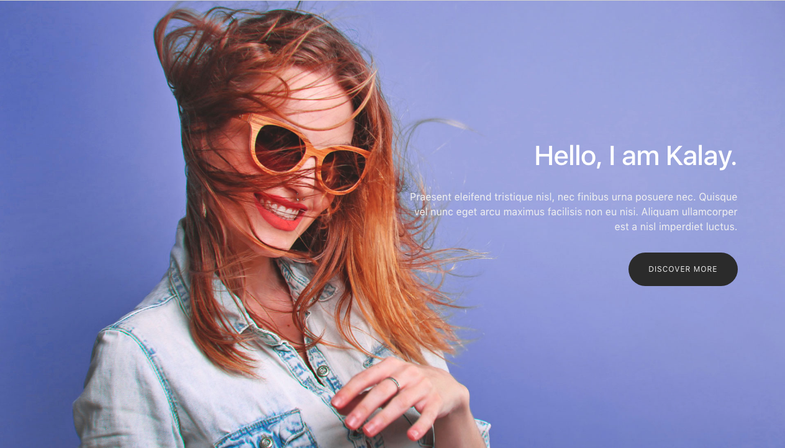

# [Kalay Template](https://costaleonardo.github.io/bootstrap-kalay-template/)

> Kalay is a graphic designer's portfolio template designed by [Tooplate](http://www.tooplate.com/) and coded by [Leonardo da Costa](https://github.com/costaleonardo). This template was built with HTML5, Bootstrap, Sass, jQuery and Gulp.

## Preview

**[View Live Preview](https://costaleonardo.github.io/bootstrap-kalay-template/)**

## Download and Installation

To begin using this template, choose one of the following options to get started:

* Clone the repo: `git clone https://github.com/costaleonardo/bootstrap-kalay-template.git`
* [Fork, Clone, or Download on GitHub](https://github.com/costaleonardo/bootstrap-kalay-template)

## Bugs and Issues

Have a bug or an issue with this template? [Open a new issue](https://github.com/costaleonardo/bootstrap-kalay-template/issues) here on GitHub.

## Copyright and License

This project is licensed under the [MIT](https://opensource.org/licenses/MIT) License.
